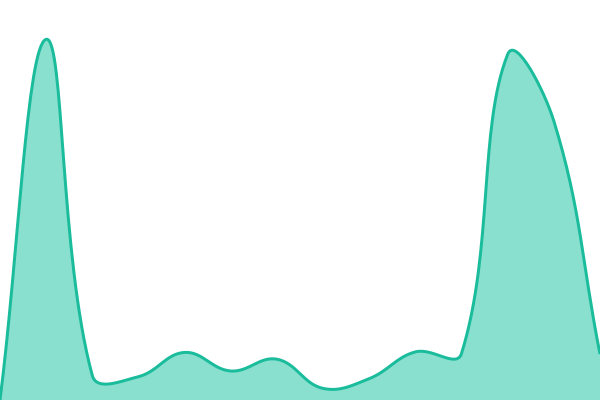
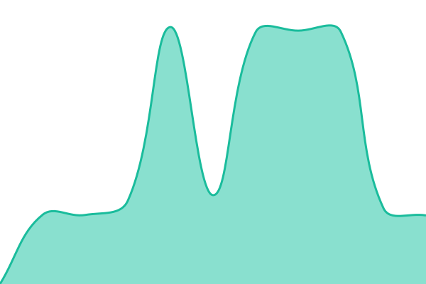
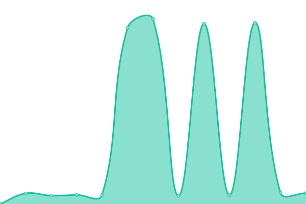
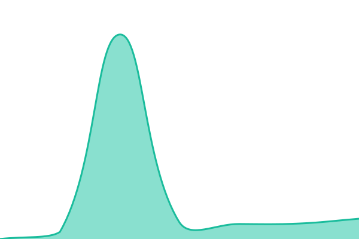

# [📈 Live Status](https://mcmod-info-mirror.github.io/upptime): <!--live status--> **🟥 Complete outage**

This repository contains the open-source uptime monitor and status page for [mcmod-info-mirror](https://github.com/mcmod-info-mirror), powered by [Upptime](https://github.com/upptime/upptime).

With [Upptime](https://upptime.js.org), you can get your own unlimited and free uptime monitor and status page, powered entirely by a GitHub repository. We use [Issues](https://github.com/mcmod-info-mirror/upptime/issues) as incident reports, [Actions](https://github.com/mcmod-info-mirror/upptime/actions) as uptime monitors, and [Pages](https://mcmod-info-mirror.github.io/upptime) for the status page.

<!--start: status pages-->
<!-- This summary is generated by Upptime (https://github.com/upptime/upptime) -->
<!-- Do not edit this manually, your changes will be overwritten -->
<!-- prettier-ignore -->
| URL | Status | History | Response Time | Uptime |
| --- | ------ | ------- | ------------- | ------ |
|  [MCIM-root](https://mod.mcimirror.top) | 🟥 Down | [mcim-root.yml](https://github.com/mcmod-info-mirror/upptime/commits/HEAD/history/mcim-root.yml) | 

 673ms
     
 | 

<a href="https://mcmod-info-mirror.github.io/upptime/history/mcim-root">98.57%</a>
    

|  [MCIM-docs](https://mod.mcimirror.top/docs) | 🟥 Down | [mcim-docs.yml](https://github.com/mcmod-info-mirror/upptime/commits/HEAD/history/mcim-docs.yml) | 

 528ms
     
 | 

<a href="https://mcmod-info-mirror.github.io/upptime/history/mcim-docs">98.58%</a>
    

|  [MCIM-Curseforge Search](https://mod.mcimirror.top/curseforge/v1/mods/search?gameId=432&pageSize=50) | 🟥 Down | [mcim-curseforge-search.yml](https://github.com/mcmod-info-mirror/upptime/commits/HEAD/history/mcim-curseforge-search.yml) | 

 6333ms
     
 | 

<a href="https://mcmod-info-mirror.github.io/upptime/history/mcim-curseforge-search">98.59%</a>
    

|  [MCIM-Curseforge Mod](https://mod.mcimirror.top/curseforge/v1/mods/238222) | 🟥 Down | [mcim-curseforge-mod.yml](https://github.com/mcmod-info-mirror/upptime/commits/HEAD/history/mcim-curseforge-mod.yml) | 

 1243ms
     
 | 

<a href="https://mcmod-info-mirror.github.io/upptime/history/mcim-curseforge-mod">98.60%</a>
    

|  [MCIM-Curseforge Single File](https://mod.mcimirror.top/curseforge/v1/mods/256717/files/2666198) | 🟥 Down | [mcim-curseforge-single-file.yml](https://github.com/mcmod-info-mirror/upptime/commits/HEAD/history/mcim-curseforge-single-file.yml) | 

 230ms
     
 | 

<a href="https://mcmod-info-mirror.github.io/upptime/history/mcim-curseforge-single-file">98.61%</a>
    

|  [MCIM-Curseforge Files](https://mod.mcimirror.top/curseforge/v1/mods/238222/files) | 🟥 Down | [mcim-curseforge-files.yml](https://github.com/mcmod-info-mirror/upptime/commits/HEAD/history/mcim-curseforge-files.yml) | 

 2579ms
     
 | 

<a href="https://mcmod-info-mirror.github.io/upptime/history/mcim-curseforge-files">98.62%</a>
    

|  [MCIM-Curseforge Fingerprints](https://mod.mcimirror.top/curseforge/v1/fingerprints) | 🟥 Down | [mcim-curseforge-fingerprints.yml](https://github.com/mcmod-info-mirror/upptime/commits/HEAD/history/mcim-curseforge-fingerprints.yml) | 

 643ms
     
 | 

<a href="https://mcmod-info-mirror.github.io/upptime/history/mcim-curseforge-fingerprints">98.63%</a>
    

|  [MCIM-Curseforge Fingerprints 432](https://mod.mcimirror.top/curseforge/v1/fingerprints/432) | 🟥 Down | [mcim-curseforge-fingerprints-432.yml](https://github.com/mcmod-info-mirror/upptime/commits/HEAD/history/mcim-curseforge-fingerprints-432.yml) | 

 415ms
     
 | 

<a href="https://mcmod-info-mirror.github.io/upptime/history/mcim-curseforge-fingerprints-432">98.64%</a>
    

|  [MCIM-Modrinth Search](https://mod.mcimirror.top/modrinth/v2/search?offset=0&limit=10&index=relevance) | 🟥 Down | [mcim-modrinth-search.yml](https://github.com/mcmod-info-mirror/upptime/commits/HEAD/history/mcim-modrinth-search.yml) | 

 902ms
     
 | 

<a href="https://mcmod-info-mirror.github.io/upptime/history/mcim-modrinth-search">98.65%</a>
    

|  [MCIM-Modrinth Project](https://mod.mcimirror.top/modrinth/v2/project/sodium-extra) | 🟥 Down | [mcim-modrinth-project.yml](https://github.com/mcmod-info-mirror/upptime/commits/HEAD/history/mcim-modrinth-project.yml) | 

 300ms
     
 | 

<a href="https://mcmod-info-mirror.github.io/upptime/history/mcim-modrinth-project">98.66%</a>
    

|  [MCIM-Modrinth Versions](https://mod.mcimirror.top/modrinth/v2/project/sodium-extra/version) | 🟥 Down | [mcim-modrinth-versions.yml](https://github.com/mcmod-info-mirror/upptime/commits/HEAD/history/mcim-modrinth-versions.yml) | 

 7006ms
     
 | 

<a href="https://mcmod-info-mirror.github.io/upptime/history/mcim-modrinth-versions">98.66%</a>
    

|  [MCIM-Modrinth Single Version](https://mod.mcimirror.top/modrinth/v2/version/3JJvf9Kn) | 🟥 Down | [mcim-modrinth-single-version.yml](https://github.com/mcmod-info-mirror/upptime/commits/HEAD/history/mcim-modrinth-single-version.yml) | 

 581ms
     
 | 

<a href="https://mcmod-info-mirror.github.io/upptime/history/mcim-modrinth-single-version">98.67%</a>
    

|  [MCIM-Modrinth hash](https://mod.mcimirror.top/modrinth/v2/version_file/acac3670ee25cc10ed63136e5dd3b792acd13595?algorithm=sha1) | 🟥 Down | [mcim-modrinth-hash.yml](https://github.com/mcmod-info-mirror/upptime/commits/HEAD/history/mcim-modrinth-hash.yml) | 

 297ms
     
 | 

<a href="https://mcmod-info-mirror.github.io/upptime/history/mcim-modrinth-hash">98.69%</a>
    

|  [MCIM-Modrinth Single File Update](https://mod.mcimirror.top/modrinth/v2/version_file/3257d1fe02c9f7710feec955d4e91bd1de69bbe930a3779602ea7c78920ca1f9cef3c4450158cabaddc330d2d4a96a2558d8f136c770b2657886797f2452eb24/update?algorithm=sha512) | 🟥 Down | [mcim-modrinth-single-file-update.yml](https://github.com/mcmod-info-mirror/upptime/commits/HEAD/history/mcim-modrinth-single-file-update.yml) | 

 2489ms
     
 | 

<a href="https://mcmod-info-mirror.github.io/upptime/history/mcim-modrinth-single-file-update">98.70%</a>
    

|  [MCIM-Modrinth Files Update](https://mod.mcimirror.top/modrinth/v2/version_files/update) | 🟥 Down | [mcim-modrinth-files-update.yml](https://github.com/mcmod-info-mirror/upptime/commits/HEAD/history/mcim-modrinth-files-update.yml) | 

 369ms
     
 | 

<a href="https://mcmod-info-mirror.github.io/upptime/history/mcim-modrinth-files-update">98.71%</a>
    

|  [MCIM-Modrinth file cdn](https://mod.mcimirror.top/data/P7dR8mSH/versions/Y0cpssyN/fabric-api-0.100.6%2B1.21.jar) | 🟥 Down | [mcim-modrinth-file-cdn.yml](https://github.com/mcmod-info-mirror/upptime/commits/HEAD/history/mcim-modrinth-file-cdn.yml) | 

 687ms
     
 | 

<a href="https://mcmod-info-mirror.github.io/upptime/history/mcim-modrinth-file-cdn">11.43%</a>
    

|  [MCIM-Curseforge file cdn](https://mod.mcimirror.top/files/5106/178/jei-1.19.2-forge-11.6.0.1019.jar) | 🟥 Down | [mcim-curseforge-file-cdn.yml](https://github.com/mcmod-info-mirror/upptime/commits/HEAD/history/mcim-curseforge-file-cdn.yml) | 

 275ms
     
 | 

<a href="https://mcmod-info-mirror.github.io/upptime/history/mcim-curseforge-file-cdn">11.44%</a>
    

<!--end: status pages-->

[**Visit our status website →**](https://mcmod-info-mirror.github.io/upptime)

## 📄 License

- Powered by: [Upptime](https://github.com/upptime/upptime)
- Code: [MIT](./LICENSE) © [Anand Chowdhary](https://anandchowdhary.com), supported by [Pabio](https://pabio.com)
- Data in the `./history` directory: [Open Database License](https://opendatacommons.org/licenses/odbl/1-0/)
